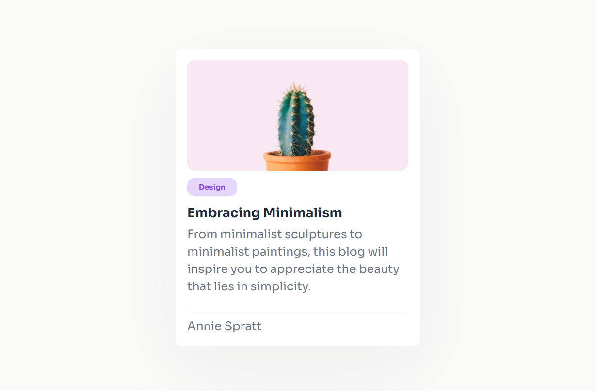

# Minimal Blog Card
This practice project is my solution to a [Dev Challenges](https://devchallenges.io/) challenge.

## The Overview

### The Challenge 
The end goal is to create a simple and minmal blog card that is somewhat responsive. 

### Screenshot

### Links
- Solution URL: [GitHub Repo]()
- Live Site URL: [Demo]()

## My Process

### Built With
Simple tools. All vanilla.
- CSS
- Semantic HTML5

## Author
- [Website](https://www.evaliavarona.com)
- [Linkedin](www.linkedin.com/in/evalia-varona-614131264)
